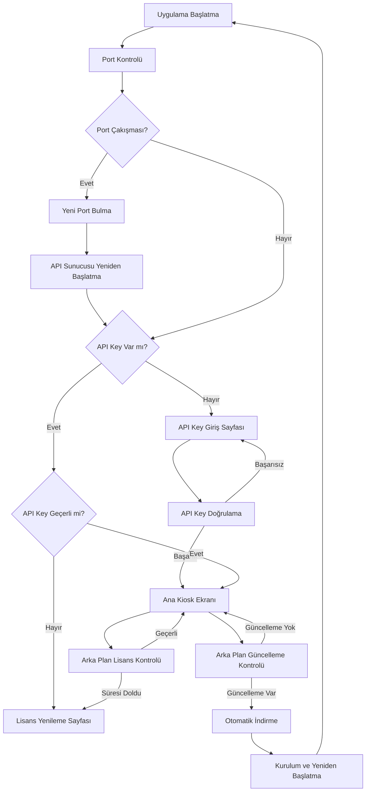

# Kiosk Yazılımı - Ürün Gereksinimleri Dökümanı

## 1. Ürün Genel Bakış
Electron tabanlı masaüstü kiosk yazılımı, TypeScript ve Express API sunucusu ile geliştirilecek basit lisans doğrulama sistemi.
- API key tabanlı lisans doğrulama sistemi ile çalışan kiosk uygulaması
- Sürekli arka plan lisans kontrolü ve otomatik yönlendirme
- Basit yapı ile minimum konfigürasyon gerektiren sistem

## 2. Temel Özellikler

### 2.1 Kullanıcı Rolleri
Bu sistemde kullanıcı rolü ayrımı bulunmamaktadır. Sadece API key ile lisans doğrulaması yapılır.

### 2.2 Özellik Modülleri
Kiosk yazılımı aşağıdaki ana sayfalardan oluşur:
1. **API Key Giriş Sayfası**: lisans anahtarı girişi, doğrulama işlemi
2. **Ana Kiosk Ekranı**: basit kiosk arayüzü, arka plan lisans kontrolü
3. **Lisans Yenileme Sayfası**: lisans süresi dolduğunda yönlendirilen sayfa
4. **Otomatik Güncelleme Sistemi**: uzaktan güncelleme kontrolü, otomatik indirme ve kurulum
5. **Dinamik Port Yönetimi**: port çakışması kontrolü, otomatik yeni port bulma

### 2.3 Sayfa Detayları
| Sayfa Adı | Modül Adı | Özellik Açıklaması |
|-----------|-----------|--------------------||
| API Key Giriş Sayfası | Lisans Doğrulama | API key girişi, sunucu ile doğrulama, geçerlilik kontrolü |
| Ana Kiosk Ekranı | Kiosk Arayüzü | Basit kiosk ekranı, arka plan lisans kontrolü |
| Ana Kiosk Ekranı | Lisans Kontrolü | Sürekli API key doğrulama, otomatik yönlendirme |
| Lisans Yenileme Sayfası | Yenileme İşlemi | Lisans süresi dolduğunda gösterilen sayfa, yenileme talimatları |
| Otomatik Güncelleme | Güncelleme Kontrolü | Uzaktan güncelleme kontrolü, versiyon karşılaştırma, otomatik indirme |
| Otomatik Güncelleme | Kurulum Yönetimi | Güncelleme paketi kurulumu, yeniden başlatma, rollback desteği |
| Port Yönetimi | Port Kontrolü | Aktif port tarama, çakışma tespiti, otomatik yeni port bulma |
| Port Yönetimi | Servis Yönetimi | API sunucusu port değişikliği, otomatik yeniden başlatma |

## 3. Temel Süreç

### 3.1 Ana Uygulama Akışı
Uygulama başlatma → Port kontrolü → API key kontrolü → Geçerliyse kiosk ekranı / Geçersizse giriş sayfası → Sürekli arka plan kontrolü → Lisans dolduğunda yenileme sayfası

### 3.2 Otomatik Güncelleme Akışı
Arka plan güncelleme kontrolü → Yeni versiyon tespiti → Kullanıcı bildirimi → Otomatik indirme → Kurulum → Yeniden başlatma

### 3.3 Dinamik Port Yönetimi Akışı
Port kullanılabilirlik kontrolü → Çakışma tespiti → Yeni port bulma → API sunucusu yeniden başlatma → Bağlantı güncelleme

## 4. Kullanıcı Arayüzü Tasarımı
### 4.1 Tasarım Stili
- Ana renkler: Koyu mavi (#2C3E50), Açık mavi (#3498DB)
- İkincil renkler: Beyaz (#FFFFFF), Gri (#95A5A6)
- Buton stili: Modern flat tasarım, yuvarlatılmış köşeler (8px radius)
- Font: Roboto, 16px ana metin, 24px başlıklar
- Layout stili: Card tabanlı tasarım, üst navigasyon menüsü
- İkon stili: Material Design ikonları, 24px boyut

### 4.2 Sayfa Tasarım Genel Bakışı
| Sayfa Adı | Modül Adı | UI Elementleri |
|-----------|-----------|----------------|
| API Key Giriş Sayfası | Lisans Girişi | Merkezi form, API key input alanı, doğrulama butonu, durum mesajları |
| Ana Kiosk Ekranı | Kiosk Arayüzü | Tam ekran basit layout, minimal tasarım, lisans durumu göstergesi |
| Ana Kiosk Ekranı | Güncelleme Bildirimi | Güncelleme progress bar, durum mesajları, yeniden başlatma bildirimi |
| Lisans Yenileme Sayfası | Yenileme | Merkezi uyarı mesajı, yenileme talimatları, iletişim bilgileri |
| Sistem Ayarları | Port Yönetimi | Port durumu göstergesi, otomatik port değişikliği bildirimleri |
| Sistem Ayarları | Güncelleme Kontrolü | Versiyon bilgisi, güncelleme kontrol butonu, otomatik güncelleme ayarları |

### 4.3 Responsive Tasarım
Masaüstü odaklı tasarım, minimum 1024x768 çözünürlük desteği, dokunmatik ekran optimizasyonu dahil.