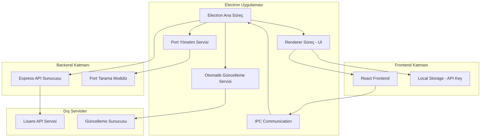
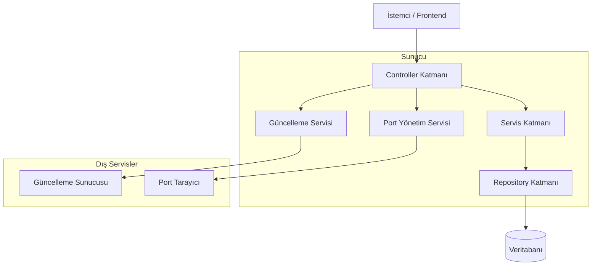
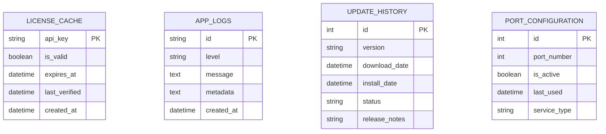

# Kiosk Yazılımı - Teknik Mimari Dokümantasyonu

## 1. Mimari Tasarım



## 2. Teknoloji Açıklaması

* Frontend: React\@18 + TypeScript\@5 + Tailwind CSS\@3 + Electron\@28

* Backend: Express\@4 + TypeScript\@5 + Node.js Port Scanner

* Güncelleme: Electron-updater + Semver + Auto-updater

* Port Yönetimi: Net module + Port-scanner + Dynamic port allocation

* Geliştirme: Webpack\@5 + ESLint + Prettier

## 3. Route Tanımları

| Route           | Amaç                                          |
| --------------- | --------------------------------------------- |
| /               | Ana kiosk ekranı, basit kiosk arayüzü |
| /license-key    | API key giriş sayfası, lisans doğrulama |
| /license-renewal | Lisans yenileme sayfası, süresi dolmuş lisanslar için |

## 4. API Tanımları

### 4.1 Temel API

#### Lisans doğrulama

```
POST /api/license/verify
```

İstek:

| Parametre Adı | Parametre Tipi | Zorunlu | Açıklama               |
| ------------- | -------------- | ------- | ---------------------- |
| apiKey        | string         | true    | Lisans API anahtarı    |

Yanıt:

| Parametre Adı | Parametre Tipi | Açıklama            |
| ------------- | -------------- | ------------------- |
| valid         | boolean        | Lisans geçerlilik durumu |
| expiresAt     | string         | Lisans bitiş tarihi |
| message       | string         | Durum mesajı        |

Örnek:

```json
{
  "apiKey": "your-license-key-here"
}
```

#### Lisans durumu kontrolü

```
GET /api/license/status
```

Parametre:

| Parametre Adı | Parametre Tipi | Zorunlu | Açıklama               |
| ------------- | -------------- | ------- | ---------------------- |
| apiKey        | string         | true    | Header'da gönderilen API key |

### 4.2 Otomatik Güncelleme API

#### Güncelleme kontrolü

```
GET /api/update/check
```

Yanıt:

| Parametre Adı | Parametre Tipi | Açıklama |
| ------------- | -------------- | -------- |
| hasUpdate | boolean | Güncelleme mevcut mu |
| version | string | Yeni versiyon numarası |
| downloadUrl | string | İndirme bağlantısı |
| releaseNotes | string | Sürüm notları |

#### Güncelleme indirme

```
POST /api/update/download
```

### 4.3 Port Yönetimi API

#### Port durumu kontrolü

```
GET /api/port/status
```

Yanıt:

| Parametre Adı | Parametre Tipi | Açıklama |
| ------------- | -------------- | -------- |
| currentPort | number | Mevcut kullanılan port |
| isAvailable | boolean | Port kullanılabilir mi |
| conflicts | array | Çakışan portlar listesi |

#### Yeni port bulma

```
POST /api/port/find-available
```

İstek:

| Parametre Adı | Parametre Tipi | Zorunlu | Açıklama |
| ------------- | -------------- | ------- | -------- |
| startPort | number | false | Başlangıç port numarası |
| endPort | number | false | Bitiş port numarası |

Not: API katmanı sonra detaylandırılacak, şimdilik sadece yapı oluşturulacak.

## 5. Sunucu Mimarisi



## 6. Veri Modeli

### 6.1 Veri Modeli Tanımı


### 6.2 Veri Tanımlama Dili
Lisans Önbellek Tablosu (license_cache)
```sql
-- tablo oluştur (Local Storage için basit yapı)
CREATE TABLE license_cache (
    api_key TEXT PRIMARY KEY,
    is_valid BOOLEAN NOT NULL DEFAULT 0,
    expires_at DATETIME,
    last_verified DATETIME DEFAULT CURRENT_TIMESTAMP,
    created_at DATETIME DEFAULT CURRENT_TIMESTAMP
);

-- indeks oluştur
CREATE INDEX idx_license_cache_expires_at ON license_cache(expires_at);
CREATE INDEX idx_license_cache_last_verified ON license_cache(last_verified);
```

Uygulama Logları Tablosu (app_logs)
```sql
CREATE TABLE app_logs (
    id TEXT PRIMARY KEY DEFAULT (lower(hex(randomblob(16)))),
    level VARCHAR(20) NOT NULL CHECK (level IN ('info', 'warn', 'error', 'debug')),
    message TEXT NOT NULL,
    metadata TEXT, -- JSON formatında
    created_at DATETIME DEFAULT CURRENT_TIMESTAMP
);

CREATE INDEX idx_app_logs_level ON app_logs(level);
CREATE INDEX idx_app_logs_created_at ON app_logs(created_at DESC);
```

Güncelleme Geçmişi Tablosu (update_history)
```sql
CREATE TABLE update_history (
    id INTEGER PRIMARY KEY AUTOINCREMENT,
    version VARCHAR(20) NOT NULL,
    download_date DATETIME,
    install_date DATETIME,
    status VARCHAR(20) DEFAULT 'pending',
    release_notes TEXT
);

CREATE INDEX idx_update_version ON update_history(version);
CREATE INDEX idx_update_status ON update_history(status);
```

Port Konfigürasyon Tablosu (port_configuration)
```sql
CREATE TABLE port_configuration (
    id INTEGER PRIMARY KEY AUTOINCREMENT,
    port_number INTEGER NOT NULL UNIQUE,
    is_active BOOLEAN DEFAULT FALSE,
    last_used DATETIME DEFAULT CURRENT_TIMESTAMP,
    service_type VARCHAR(50) DEFAULT 'api'
);

CREATE INDEX idx_port_active ON port_configuration(is_active);
CREATE INDEX idx_port_number ON port_configuration(port_number);

-- Başlangıç verileri
INSERT INTO port_configuration (port_number, is_active, service_type) 
VALUES (3000, TRUE, 'api');
```

Not: Veritabanı yapısı minimal tutulmuştur. Ana veri Local Storage'da API key olarak saklanacak, veritabanı sadece önbellekleme ve loglama için kullanılacaktır.

